# ToDoApp

A task management Android app built with Jetpack Compose, featuring user authentication, real-time sync with Firebase, and offline support with Room DB.

## Features

- **User Authentication** — Register, login, stay logged in, forgot password, and change password via Firebase Auth
- **Task CRUD** — Create, edit, delete tasks with title, description, and deadline
- **Task List** — Sort by default/completed, search by title or description, mark tasks as done
- **Cross-device Sync** — Background sync with Firebase Realtime Database via WorkManager
- **Offline Support** — Room local database with sync-on-reconnect
- **Side Menu Drawer** — Reset password, change password, and log out

## Tech Stack

| Layer | Technology |
|-------|-----------|
| UI | Jetpack Compose, Material 3 |
| Navigation | Compose Navigation 2.9 (type-safe routes) |
| DI | Hilt |
| Local DB | Room |
| Remote DB | Firebase Realtime Database |
| Auth | Firebase Auth |
| Background | WorkManager |
| Persistence | DataStore Preferences |

## Screenshots

### Login


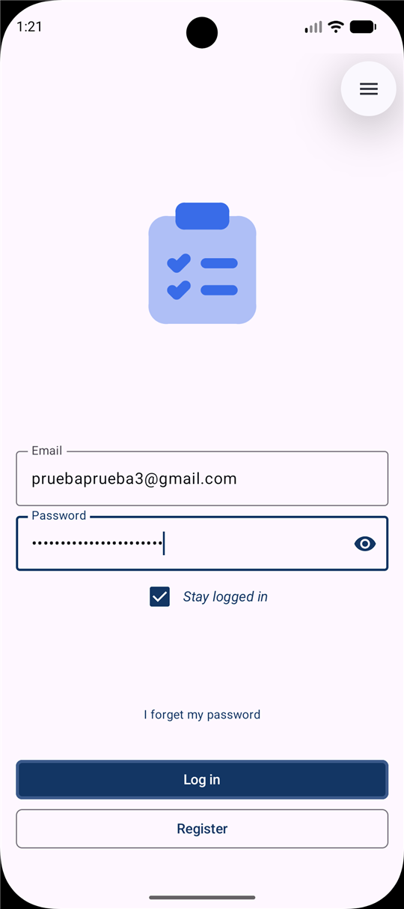

### Register


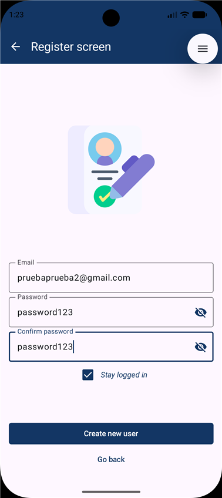
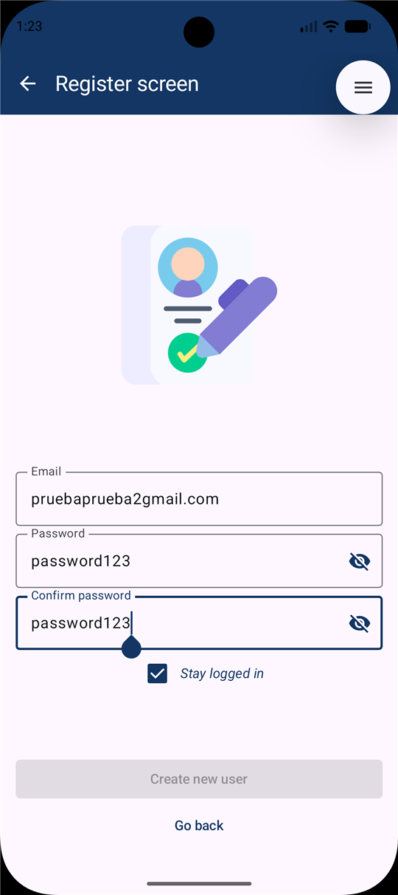

### Task List

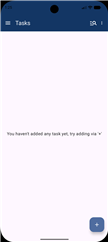

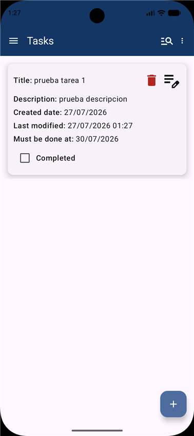
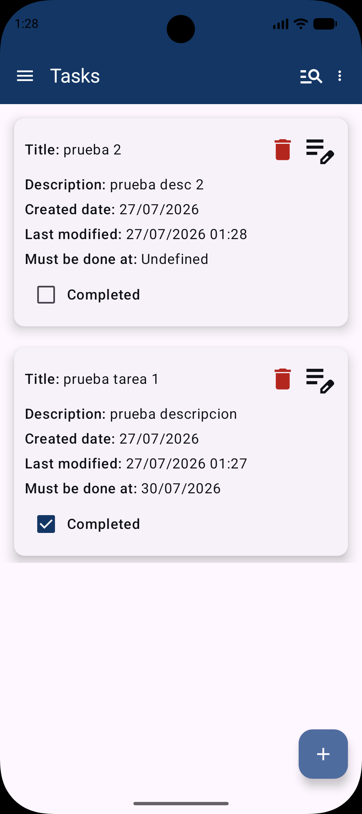
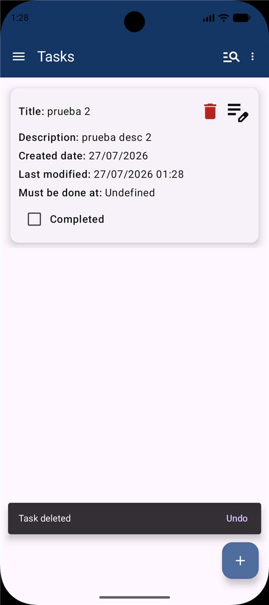
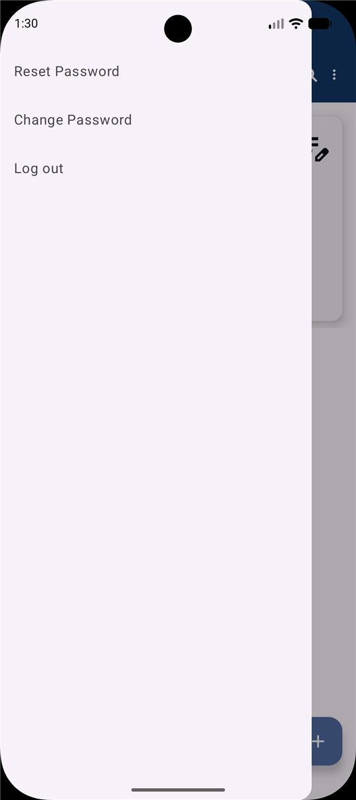

### Reset Password

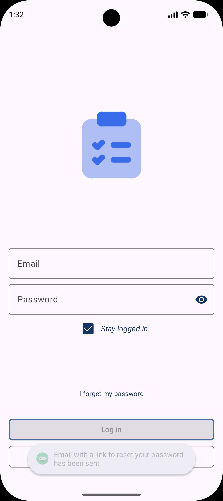


### Change Password

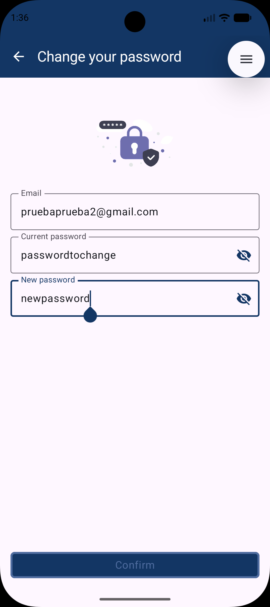
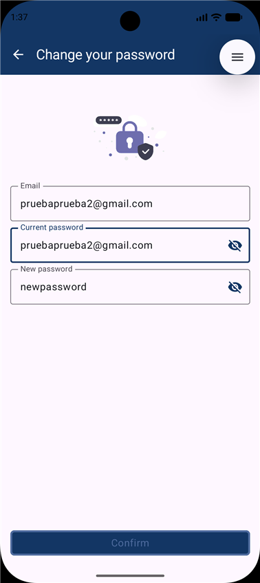

### New / Edit Task

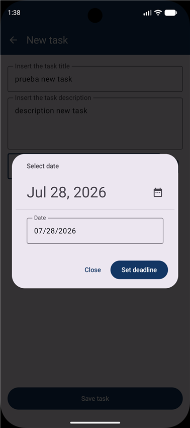
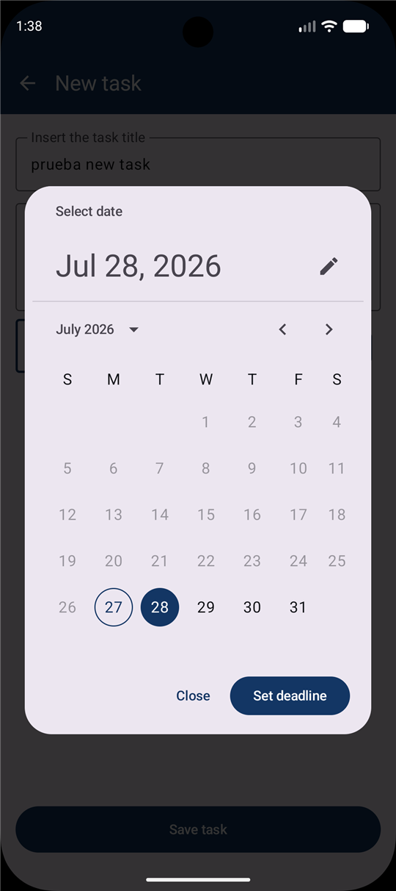

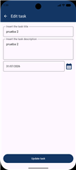
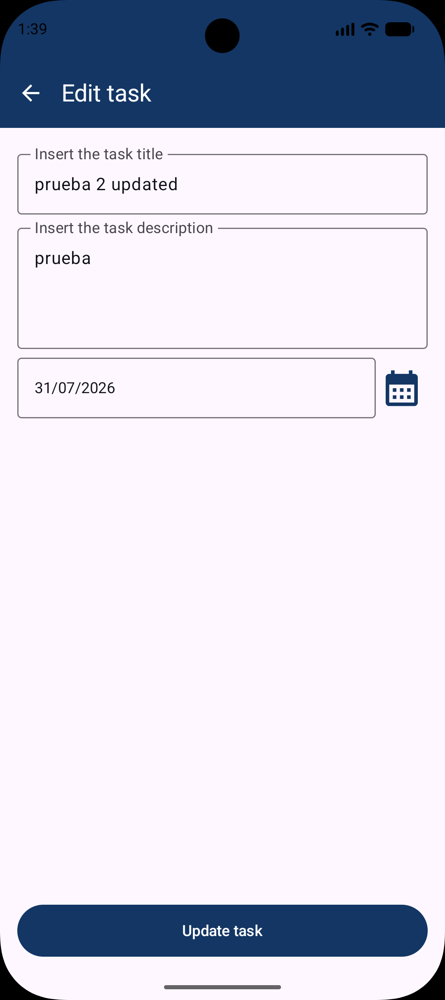
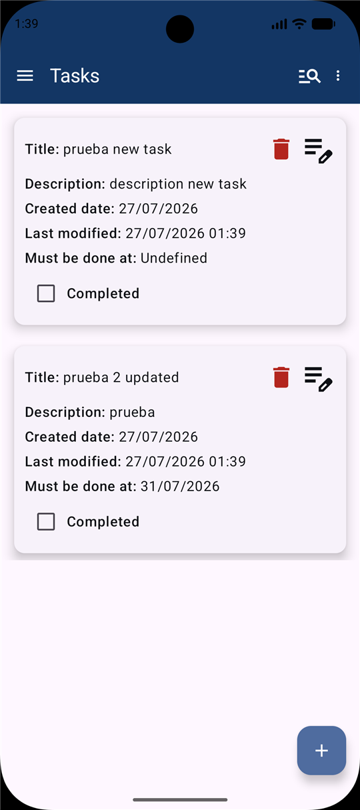
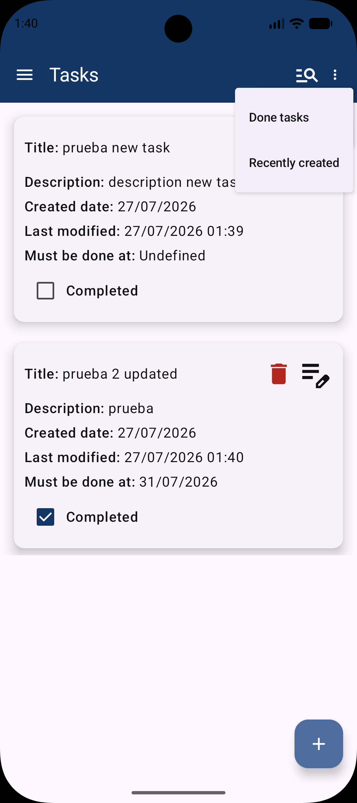

## Project Structure

```
app/src/main/java/com/arturojas32/todoapp/
├── data/
│   ├── di/                    # Hilt modules
│   ├── local/                 # Room DB, DAO, entities
│   ├── mappers/               # Entity ↔ Domain mappers
│   └── network/               # Firebase auth & remote DB
├── domain/
│   ├── model/                 # Domain models (Task, AuthUser)
│   └── repository/            # Repository interfaces
├── navigation/                # NavWrapper, routes
├── ui/
│   ├── components/            # Reusable composables
│   ├── screens/               # Screen composables
│   ├── viewmodels/            # ViewModels
│   └── theme/                 # Material theme
└── utils/                     # Validators, SyncManager
```

## Getting Started

1. Clone the repo
2. Add your `google-services.json` in `app/`
3. Build and run on device/emulator (min SDK 26)
